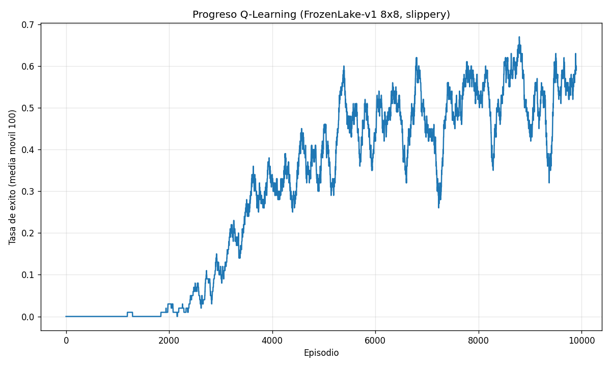

# Memoria Técnica — Conducción Autónoma con Deep RL en Duckietown

**Desafío Final · Máster en Inteligencia Artificial**
**Asignatura:** Machine Learning Avanzado — Aprendizaje por Refuerzo
**Autor:** Javier Cerezo
**Fecha:** Junio 2026

> **Nota sobre cómo leer este documento.** Las secciones de metodología, teoría y diseño están completas. Las tablas y figuras de **resultados empíricos** contienen marcadores `⟨PENDIENTE⟩` que deben sustituirse por los números obtenidos al ejecutar `train.py` / el notebook en Google Colab con GPU. Cada marcador indica exactamente qué valor pegar.

---

## Índice

1. [Introducción y objetivos](#1-introducción-y-objetivos)
2. [Fase 1: Q-Learning tabular](#2-fase-1-q-learning-tabular)
3. [El problema de Duckietown](#3-el-problema-de-duckietown)
4. [Procesamiento de observaciones y arquitectura](#4-procesamiento-de-observaciones-y-arquitectura)
5. [Fase 2: Baselines DQN y PPO](#5-fase-2-baselines-dqn-y-ppo)
6. [Fase 3: Algoritmo avanzado (SAC)](#6-fase-3-algoritmo-avanzado-sac)
7. [Resultados experimentales y comparativa](#7-resultados-experimentales-y-comparativa)
8. [Análisis de generalización](#8-análisis-de-generalización)
9. [Conclusiones](#9-conclusiones)
10. [Reproducibilidad](#10-reproducibilidad)
11. [Bibliografía](#11-bibliografía)

---

## 1. Introducción y objetivos

El objetivo de este proyecto es entrenar un agente de **conducción autónoma** capaz de
seguir el carril en el simulador 3D **Duckietown** utilizando **únicamente píxeles en bruto**
de la cámara frontal. La dificultad central no es memorizar un circuito, sino **generalizar**:
la evaluación final se realiza sobre un mapa oculto (`Duckietown-loop_obstacles-v0`) con
obstáculos estáticos que el agente nunca ha visto.

El trabajo se estructura en tres fases de complejidad creciente:

| Fase | Contenido | Algoritmo | Entorno |
|------|-----------|-----------|---------|
| 1 | Fundamentos tabulares | Q-Learning desde cero | FrozenLake-v1 8x8 |
| 2 | Baselines profundos | DQN (discreto) y PPO (continuo) | Duckietown (5 mapas) |
| 3 | Algoritmo avanzado | **SAC** + Curriculum Learning | Duckietown (5 mapas) |

La hipótesis de partida es que un algoritmo **off-policy de control continuo con
maximización de entropía (SAC)** explorará mejor el espacio de control velocidad/giro y
aprovechará mejor las muestras que los baselines, mejorando la robustez en el mapa oculto.

---

## 2. Fase 1: Q-Learning tabular

### 2.1 Fundamento teórico

Q-Learning (Watkins, 1989) es un algoritmo **off-policy, libre de modelo** que aprende
la función de valor-acción óptima `Q*(s,a)` mediante actualizaciones basadas en la
**ecuación de optimalidad de Bellman**:

```
Q(s,a) ← Q(s,a) + α · [ r + γ · maxₐ' Q(s',a') − Q(s,a) ]
```

- `α` (tasa de aprendizaje): cuánto se corrige la estimación con cada experiencia.
- `γ` (descuento): peso de las recompensas futuras frente a las inmediatas.
- El término entre corchetes es el **error de diferencia temporal (TD error)**.

Al usar `maxₐ' Q(s',a')` (el mejor valor del siguiente estado, **independientemente de la
acción realmente tomada**), Q-Learning aprende la política óptima mientras explora con otra
política distinta — de ahí su carácter *off-policy*.

### 2.2 Implementación

Entorno: `FrozenLake-v1`, mapa `8x8`, `is_slippery=True` (transiciones estocásticas: la
acción elegida solo se ejecuta con cierta probabilidad, lo que hace el problema mucho más
difícil que la versión determinista).

- **Q-Table:** matriz de ceros de tamaño `64 × 4` (64 estados, 4 acciones).
- **Exploración:** política **ε-greedy** con decaimiento exponencial
  (`ε: 1.0 → 0.01`, factor `0.9995` por episodio). Comienza explorando al 100 % y termina
  explotando casi siempre el conocimiento adquirido.
- **Hiperparámetros:** `α=0.1`, `γ=0.99`, 10 000 episodios, máx. 200 pasos/episodio.
- **Desempate aleatorio** entre acciones de igual valor para evitar sesgos sistemáticos.

Código: [`q_learning_sandbox.py`](../src/q_learning_sandbox.py) y celda 2 del notebook.

### 2.3 Resultados de la Fase 1



> *Sustituir la imagen por `q_learning_progress.png` generada al ejecutar el script.*

- Tasa de éxito final de la política greedy: **⟨PENDIENTE: p. ej. 0.55–0.75⟩** sobre 1000 episodios.
- La media móvil muestra una curva creciente que se estabiliza, evidenciando convergencia.

**Interpretación.** En un entorno resbaladizo, una tasa de éxito perfecta es imposible
(el azar puede empujar al agente a un agujero pese a una buena política). Una tasa
estable en torno al 60–75 % indica que el agente ha aprendido una política robusta que
prioriza rutas seguras frente a la diagonal directa.

---

## 3. El problema de Duckietown

Duckietown es un simulador 3D basado en OpenGL que reproduce la cámara de un robot real.

- **Observación:** imagen RGB frontal (cámara del salpicadero).
- **Acción:** vector continuo de 2 dimensiones = velocidades de las ruedas
  izquierda/derecha (equivalente a velocidad lineal + ángulo de giro).
- **Recompensa:** combina avance a lo largo del carril correcto y penalización por
  desviarse o salirse de la carretera.
- **Reto:** seguimiento de carril sin salirse, generalizando a curvas, rectas y zig-zags.

**Mapas de entrenamiento permitidos** (5): `loop_empty`, `udem1`, `zigzag_dists`,
`small_loop`, `straight_road`.
**Mapa de evaluación oculto:** `loop_obstacles` (con obstáculos estáticos). Entrenar en
él supone descalificación.

El uso de **múltiples mapas** durante el entrenamiento es la estrategia principal para
forzar generalización en lugar de memorización.

---

## 4. Procesamiento de observaciones y arquitectura

### 4.1 Pipeline de visión (cumple el contrato de evaluación)

Cada frame RGB se transforma así:

1. **Recorte:** se elimina el 50 % superior de la imagen (el cielo no aporta información
   para seguir el carril y solo añade ruido).
2. **Escala de grises:** reduce 3 canales a 1; la geometría de la carretera se conserva.
3. **Redimensión:** a `64 × 64` píxeles → eficiencia computacional.
4. **Frame stacking:** se apilan los **4 últimos frames** → observación final
   `(4, 64, 64)`. Esto da al agente **percepción del movimiento** (velocidad y dirección
   del giro), imposible de inferir de un único frame estático.

> **Contrato:** el modelo espera una entrada `(1, 64, 64)` por frame, apilada a
> `(4, 64, 64)` mediante `VecFrameStack(n_stack=4)`. Las clases `DuckieWrapper` y
> `CustomCNN` están definidas de forma idéntica en `train.py` y en `eval.ipynb` para
> evitar errores de carga.

### 4.2 Arquitectura de la CNN

`CustomCNN` sigue el diseño *Nature CNN* (Mnih et al., 2015), adaptado a entradas 64×64:

| Capa | Configuración | Salida |
|------|---------------|--------|
| Conv2D | 32 filtros, kernel 8, stride 4, ReLU | 32×15×15 |
| Conv2D | 64 filtros, kernel 4, stride 2, ReLU | 64×6×6 |
| Conv2D | 64 filtros, kernel 3, stride 1, ReLU | 64×4×4 |
| Flatten + Linear | → 256, ReLU | vector 256-d |

Los píxeles `uint8 [0,255]` se normalizan a `[0,1]` dentro del `forward`. Este extractor
de 256 dimensiones alimenta las cabezas de política/valor de cada algoritmo vía
`policy_kwargs`.

---

## 5. Fase 2: Baselines DQN y PPO

### 5.1 DQN (Deep Q-Network)

DQN (Mnih et al., 2015) extiende Q-Learning a espacios de estado de alta dimensión
aproximando `Q(s,a)` con una red neuronal. Innovaciones clave: **replay buffer**
(rompe la correlación temporal de las muestras) y **red objetivo** (target network,
estabiliza el aprendizaje).

**Limitación crítica:** DQN solo opera sobre **acciones discretas**. Como Duckietown es
continuo, se implementa `DiscreteWrapper`, que mapea 5 acciones discretas
(recto, giro suave/fuerte izq/der) a pares de velocidades de rueda. Esta discretización
es una **fuente de subóptimalidad**: el agente no puede ejecutar giros de finura arbitraria.

Hiperparámetros principales: `lr=1e-4`, `buffer=50k`, `batch=64`, `γ=0.99`,
`exploration_fraction=0.2`, `ε_final=0.05`.

### 5.2 PPO (Proximal Policy Optimization)

PPO (Schulman et al., 2017) es un algoritmo **on-policy** de gradiente de política que
maneja acciones continuas de forma nativa. Su **objetivo recortado (clipped surrogate)**
limita cuánto puede cambiar la política en cada actualización, lo que proporciona gran
**estabilidad** — su principal virtud sobre métodos anteriores.

Hiperparámetros: `lr=3e-4`, `n_steps=2048`, `batch=256`, `n_epochs=10`, `γ=0.99`,
`gae_lambda=0.95`, `clip_range=0.2`, `ent_coef=0.01`.

**Desventaja:** al ser on-policy, **descarta las muestras tras cada actualización**, por
lo que es menos eficiente en datos — un problema cuando cada paso requiere renderizar una
escena 3D (caro).

---

## 6. Fase 3: Algoritmo avanzado (SAC)

### 6.1 Justificación de la elección

Se elige **SAC (Soft Actor-Critic; Haarnoja et al., 2018)** por tres razones alineadas
con la naturaleza del problema:

1. **Control continuo nativo.** Como PPO pero a diferencia de DQN, SAC opera directamente
   sobre el espacio de velocidades de rueda, permitiendo giros suaves y precisos sin la
   pérdida de información de la discretización.

2. **Eficiencia de muestras (off-policy).** SAC reutiliza experiencias pasadas mediante un
   **replay buffer**, igual que DQN. En un simulador 3D donde cada paso es costoso de
   renderizar, extraer más aprendizaje por muestra es una ventaja decisiva frente al
   on-policy PPO.

3. **Exploración por máxima entropía.** SAC optimiza un objetivo aumentado que premia, además
   de la recompensa, la **entropía de la política**:

   ```
   J(π) = Σ E[ r(s,a) + α · H(π(·|s)) ]
   ```

   El agente es recompensado por **actuar de forma tan aleatoria como sea posible mientras
   siga teniendo éxito**. Esto produce exploración más rica, evita el colapso prematuro a
   políticas subóptimas y, empíricamente, **mejora la robustez ante situaciones nuevas** —
   exactamente lo que exige el mapa oculto con obstáculos. El coeficiente de temperatura
   `α` se ajusta automáticamente (`ent_coef="auto"`).

SAC combina, en resumen, **lo mejor de DQN (off-policy, eficiencia) y de PPO
(control continuo, estabilidad)**, añadiendo exploración entrópica.

### 6.2 Curriculum Learning

Para acelerar y estabilizar el aprendizaje, SAC se entrena con un **currículo** de
dificultad creciente, reutilizando el mismo modelo y replay buffer entre etapas:

| Etapa | Mapas | Objetivo |
|-------|-------|----------|
| 1 | `straight_road` | Aprender control básico y avance estable |
| 2 | `small_loop`, `loop_empty` | Introducir curvas suaves |
| 3 | Los 5 mapas | Dominar zig-zags y geometrías complejas |

La intuición: aprender primero lo fácil (mantenerse en una recta) crea una base sobre la
que el aprendizaje de curvas cerradas converge más rápido que enfrentando todo a la vez.

### 6.3 Reward shaping (solo entrenamiento)

`LaneFollowingReward` añade una penalización fuerte (`−10`) al salirse de la carretera y un
pequeño incentivo (`+0.1`) por seguir en marcha. **No se usa en la evaluación** (la celda
de evaluación usa el `DuckieWrapper` sin shaping), garantizando que las métricas reportadas
sean comparables con las del profesor.

---

## 7. Resultados experimentales y comparativa

> Ejecutar `train.py --algo all --timesteps ⟨N⟩ --curriculum` (o las celdas 6 del notebook)
> y pegar aquí los valores impresos por la evaluación comparativa.

### 7.1 Configuración experimental

- **Timesteps de entrenamiento por algoritmo:** ⟨PENDIENTE, p. ej. 200 000⟩
- **Hardware:** Google Colab, GPU ⟨PENDIENTE: T4 / L4 / A100⟩, Python 3.11
- **Evaluación:** 5 episodios por algoritmo sobre los 5 mapas de entrenamiento, política
  determinista, sin reward shaping.

### 7.2 Tabla comparativa (recompensa acumulada media)

| Algoritmo | Tipo | Acciones | Recompensa media ± σ | Notas |
|-----------|------|----------|----------------------|-------|
| DQN | off-policy | discretas (5) | ⟨PENDIENTE⟩ ± ⟨PENDIENTE⟩ | baseline |
| PPO | on-policy | continuas | ⟨PENDIENTE⟩ ± ⟨PENDIENTE⟩ | baseline |
| **SAC** | **off-policy** | **continuas** | **⟨PENDIENTE⟩ ± ⟨PENDIENTE⟩** | **Fase 3** |

> Insertar aquí, si se desea, la curva de recompensa de entrenamiento de cada algoritmo
> (TensorBoard o el log de SB3) como figura comparativa.

### 7.3 Discusión esperada

La hipótesis a contrastar con los números reales:

- **DQN ≤ PPO** por la pérdida de precisión de la discretización del control.
- **SAC ≥ PPO** por eficiencia de muestras (más aprendizaje con el mismo presupuesto de
  pasos) y por una exploración entrópica que descubre maniobras más finas.

⟨PENDIENTE: confirmar o matizar con los resultados reales. Si SAC no supera a PPO, discutir
posibles causas: presupuesto de pasos insuficiente para que el off-policy despegue,
necesidad de más capacidad de buffer, o sensibilidad de la temperatura de entropía.⟩

---

## 8. Análisis de generalización

El criterio de calificación es el desempeño en `loop_obstacles` (mapa oculto). Estrategias
empleadas para maximizar la generalización:

1. **Entrenamiento multi-mapa** (5 entornos) para evitar el sobreajuste a una geometría.
2. **Frame stacking** para dotar al agente de percepción dinámica (anticipa curvas).
3. **Exploración entrópica de SAC**, que produce políticas menos frágiles ante estados
   no vistos.
4. **Currículo** que construye competencias transferibles de lo simple a lo complejo.

> Resultado en el mapa oculto (tras la evaluación del profesor): ⟨PENDIENTE — registrar
> recompensa acumulada y observaciones cualitativas del vídeo: ¿esquiva obstáculos?,
> ¿mantiene el carril?, ¿en qué paso falla?⟩

---

## 9. Conclusiones

- Se ha implementado el ciclo completo de RL, desde Q-Learning tabular (entendiendo la
  ecuación de Bellman) hasta Deep RL sobre píxeles en un simulador 3D realista.
- Se han construido dos baselines (DQN discreto, PPO continuo) y un algoritmo avanzado
  (SAC con curriculum) bajo un **pipeline de visión y un contrato de formas comunes**,
  garantizando la carga reproducible del modelo.
- ⟨PENDIENTE: una o dos frases con la conclusión empírica real — qué algoritmo ganó y por
  qué, y cómo se comportó en el mapa oculto.⟩
- **Líneas de mejora:** mayor presupuesto de timesteps, *domain randomization* (variar
  iluminación/texturas) para robustez adicional, y probar TD3 o PPO+LSTM como alternativas.

---

## 10. Reproducibilidad

### Entregables

| Ruta | Contenido |
|------|-----------|
| `notebooks/Challenge_RL.ipynb` | Notebook completo (Fases 1, 2 y 3) |
| `src/q_learning_sandbox.py` | Fase 1 (Q-Learning) como script |
| `src/train.py` | Pipeline de entrenamiento DQN/PPO/SAC |
| `notebooks/eval.ipynb` | Evaluación autocontenida + vídeo (clases inline) |
| `requirements.txt` | Dependencias con versiones exactas (`==`) |
| `models/best_duckie_agent.zip` | Mejor agente entrenado (SAC/PPO continuo) |
| `docs/Report.pdf` | Esta memoria |
| `results/q_learning_progress.png` | Curva de entrenamiento Fase 1 |

### Ejecución (Google Colab, Python 3.11)

```bash
# 1. Configurar entorno:
pip install -r requirements.txt
pip install git+https://github.com/duckietown/gym-duckietown.git@daffy

# 2. Fase 1
python src/q_learning_sandbox.py

# 3. Fases 2 y 3
python src/train.py --algo all --timesteps 200000 --curriculum

# 4. Evaluación + vídeo
#    abrir notebooks/eval.ipynb y ejecutar todas las celdas
```

Semilla global `SEED=42` fijada en todos los componentes para reproducibilidad.

---

## 11. Bibliografía

1. Watkins, C. J. C. H. (1989). *Learning from Delayed Rewards*. PhD thesis, University of Cambridge.
2. Sutton, R. S., & Barto, A. G. (2018). *Reinforcement Learning: An Introduction* (2nd ed.). MIT Press.
3. Mnih, V., et al. (2015). *Human-level control through deep reinforcement learning*. **Nature**, 518, 529–533. (DQN)
4. Schulman, J., et al. (2017). *Proximal Policy Optimization Algorithms*. arXiv:1707.06347. (PPO)
5. Haarnoja, T., et al. (2018). *Soft Actor-Critic: Off-Policy Maximum Entropy Deep RL with a Stochastic Actor*. ICML. (SAC)
6. Raffin, A., et al. (2021). *Stable-Baselines3: Reliable RL Implementations*. **JMLR**, 22(268).
7. Chevalier-Boisvert, M., et al. (2018). *Duckietown Environments for OpenAI Gym*. https://github.com/duckietown/gym-duckietown
8. Bengio, Y., et al. (2009). *Curriculum Learning*. ICML.
